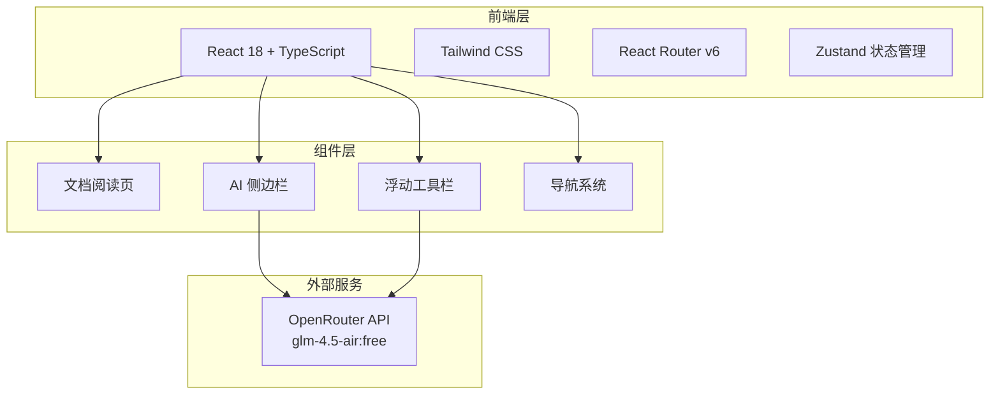

# 技术架构文档 - AI 智能帮助文档系统

## 1. 架构设计



## 2. 技术说明

- **前端框架**：React 18 + TypeScript
- **构建工具**：Vite
- **样式方案**：Tailwind CSS 3
- **路由**：React Router DOM v6
- **状态管理**：Zustand
- **Markdown 渲染**：react-markdown + remark-gfm + rehype-highlight
- **图标库**：lucide-react
- **AI 接口**：OpenRouter API（glm-4.5-air:free），流式输出
- **后端**：无（纯前端，API 直接调用 OpenRouter）

## 3. 路由定义

| 路由 | 用途 |
|------|------|
| `/` | 首页，文档分类入口 |
| `/docs/:slug` | 文档阅读页，展示具体文档内容 |
| `/search` | 搜索结果页 |

## 4. API 定义

### 4.1 OpenRouter Chat Completion API

**请求地址**：`https://openrouter.ai/api/v1/chat/completions`

**请求头**：
```typescript
{
  "Authorization": "Bearer sk-or-v1-xxx",
  "Content-Type": "application/json",
  "HTTP-Referer": window.location.origin,
  "X-Title": "AI Help Docs"
}
```

**请求体**：
```typescript
interface ChatRequest {
  model: "z-ai/glm-4.5-air:free"
  messages: ChatMessage[]
  stream: true
}

interface ChatMessage {
  role: "system" | "user" | "assistant"
  content: string
}
```

**流式响应**：Server-Sent Events (SSE)

## 5. 数据模型

### 5.1 文档数据结构

```typescript
interface DocCategory {
  id: string
  title: string
  description: string
  icon: string
  articles: DocArticle[]
}

interface DocArticle {
  slug: string
  title: string
  category: string
  content: string
  order: number
}
```

### 5.2 AI 对话数据结构

```typescript
interface Conversation {
  id: string
  messages: ChatMessage[]
  createdAt: number
  pageContext: string
}

interface AIState {
  isOpen: boolean
  conversations: Conversation[]
  activeConversationId: string | null
  isLoading: boolean
}
```

## 6. 项目目录结构

```
src/
├── components/
│   ├── Layout/
│   │   ├── Sidebar.tsx          # 左侧文档导航
│   │   ├── Header.tsx           # 顶部导航栏
│   │   └── Footer.tsx           # 页脚
│   ├── AI/
│   │   ├── AISidebar.tsx        # AI 侧边栏主组件
│   │   ├── ChatMessage.tsx      # 聊天消息气泡
│   │   ├── ChatInput.tsx        # 聊天输入框
│   │   └── FloatingToolbar.tsx  # 浮动 AI 工具栏
│   ├── Docs/
│   │   ├── DocContent.tsx       # 文档内容渲染
│   │   └── DocNav.tsx           # 文档内导航（TOC）
│   └── Home/
│       ├── HeroSection.tsx      # 首页 Hero
│       └── CategoryCard.tsx     # 分类卡片
├── pages/
│   ├── HomePage.tsx
│   └── DocPage.tsx
├── hooks/
│   ├── useAIChat.ts             # AI 对话逻辑
│   ├── useSelection.ts          # 文字选中检测
│   └── useDocContent.ts         # 文档内容加载
├── stores/
│   └── aiStore.ts               # AI 状态管理
├── services/
│   └── openrouter.ts            # OpenRouter API 封装
├── data/
│   └── docs.ts                  # 示例文档数据
├── App.tsx
├── main.tsx
└── index.css
```
